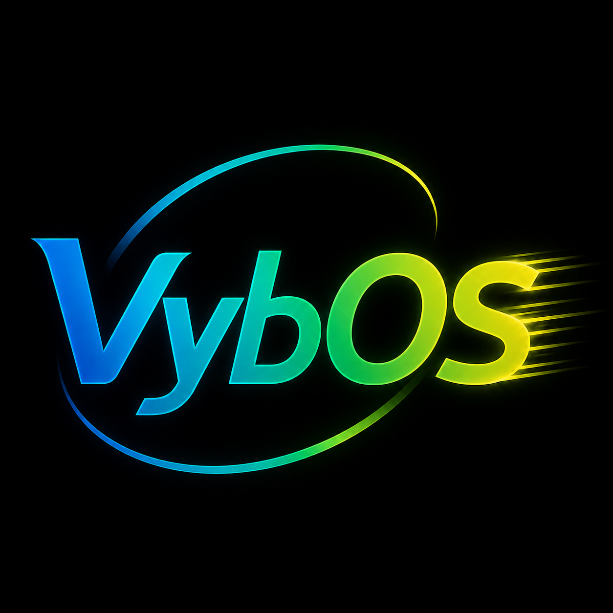

<p align="center">
  
</p>

# VybOS

## Goal

A Linux distribution with declarative, reproducible, content-addressed system
configuration — with the entire control framework written in JIT Vyb.

PID 1 is Vyb.

The core idea: a system is not described to an interpreter, it is a **Vyb
program** that the Vyb JIT compiles and runs to produce the machine's
derivation graph, activation scripts, and immutable store. There is no separate
configuration language and no store daemon in a foreign language — the config
language *is* vybey, executed through the same JIT that runs the compiler's own
runtime. Configuration, packaging, and build logic are all vybish.

VybOS is its own project, on its own terms. It shares the broad declarative/config-
as-code and content-addressing ideas that are common in the mode, but it is not a
clone and is not measured against any other distro's design or reproducibility bar.

## Status

**M0 + M1 done (2026-08-23).** Config-as-program plumbing proven: a machine
declaration (`config/system.vyb`) imports the framework (`modules/vybos.vyb`)
and JIT-evaluates to a `SystemSpec`. **M1** adds real realisation:
`build/build-store.vyb` does a real HTTP fetch, hashes the **actual** source
bytes (content-address), materializes them into `store/`, and prints stable
store paths — verified **reproducible across runs**.

**M2 done (2026-08-24).** Dependency graph → real materialization of a
transitive **closure** with `.drv`-style metadata, a **generation store with
rollback**, and **real package source-tree realization** via the stdlib
`archive` module (gzip inflate + POSIX tar extraction, byte-verified). All run
under `build/vyb` with reproducible store paths.

**Framework pipeline complete (2026-08-24).** Compose → validate → digest →
plan → execute — the whole `vyb system apply` path — plus **real HTTPS
URL-driven realization**: a package's own `source` URL is parsed by `url_split`,
the scheme selects verified-TLS transport, and real bytes are fetched,
content-addressed, and stored.

**Boot to READY (2026-08-25).** Container rootfs (`tools/vybos-run`, bwrap or
docker) and a real QEMU kernel+initramfs self-boot (`--runtime qemu`) both reach
`VYBOS_READY=1`. Kernel is the fetched Alpine netboot `vmlinuz` at that point.

**Brutal Dogfood 0.1 build stage (2026-08-25→26).** Build-stage derivations —
fetch source → **build** → content-address the OUTPUT (not just the source) —
landed and climbed the whole stack:

- **Self-hosting C compiler** — `build/build-derive-compiler.vyb`: chibicc
  GEN-1 built by the host cc, then GEN-1 recompiles chibicc's own source into
  GEN-2 (roll-your-own bootstrap). Both generations content-addressed ELF, both
  compile real programs.
- **Derived toolchain, fully from source** — gmp → mpfr → mpc → binutils
  (`as`/`ld`/`ar`) → **gcc 13.2.0 (C-only)** as build-stage derivations. The
  derived gcc compiles a real C program that runs.
- **T3: the Linux kernel as the flagship derivation** — `linux-6.6` source
  fetched over verified TLS, realized, and **compiled by the derived gcc**
  (bison/flex/elfutils built in-scratch for the x86_64 kconfig/objtool deps)
  into a content-addressed `linux-6.6-bzImage.bin`. It **boots the VybOS rootfs
  to `VYBOS_READY=1` in QEMU**, replacing the fetched vmlinuz.
- **Derived hypervisor** — `qemu-system-x86_64` 8.2.2 built from source, then
  **packaged** with its linked glib + `pc-bios` firmware into one nested store
  entry. The full roll-your-own boot now uses **only store artifacts** — no
  host qemu, no host toolchain: derived toolchain → derived kernel → derived
  hypervisor.
- **Byte-deterministic kernel (path-independent)** — build timestamp/hostname
  fixed, built twice into two *different* build roots, byte-identical bzImage.
- **Independent-build reproducibility proofs** — binutils `ld`/`as`/`ar`
  (`REPROBUILD:BINUTILS:PASS`) and the whole gcc tower built twice into
  independent build roots (`REPROBUILD:GCC:PASS`) are byte-identical.
- **Nested content-addressed store, full 256-bit SHA-256 hex** — flat store
  cleared; `store/<hexca>/<name>-<ver>.{src,bin,meta.json}` via stdlib `fs::mkdir`.

See `doc/RELEASE-BRUTAL-DOGFOOD.md`, `doc/PLAN-BUILD-DERIVATIONS.md`, and
`doc/STATUS.md` for depth and honest limits.

Also see `doc/VYB-LANGUAGE-NOTES.md` and `doc/STORE-LAYOUT.md`. Namespace/
release-channel note: `doc/NAMESPACES.md` records the intended future split
between upstream `rickenator/Vyb`, downstream `VybLang` SDK releases, and the
VybOS distro/package namespace.

## Conceptual Shape

- **Config as JIT program** — a machine's declaration is a `.vyb` program
  (`system.vyb`) that runs under `vyb --jit` and returns a `SystemSpec`
  (packages, services, boot entries, files, users, …) in a single pass.
- **Content-addressed store** — an immutable store keyed by hash of build
  inputs (name, version, source, dependency closure). This repo calls it the
  **store** (`/vyb/store` on a built system); layout in `doc/STORE-LAYOUT.md`.
- **Derivations** — a Vyb value describing "build X from inputs with recipe Y".
  The framework walks the derivation graph, JIT-runs each build recipe, and
  populates the store.
- **Generations & rollback** — the active system is an atomic switchable
  profile (a symlink generation) so rollback is instant.
- **Modules** — declarative system services/options composed in Vyb. A module
  is a typed function (params are its options), so there is no separate options
  schema to interpret — the call site is the declaration, with Vyb's own type
  safety, `select` expressions, and ownership model.
- **JIT-first** — the framework is authored and exercised via the JIT for fast
  iteration; native/AOT compilation stays a later, portability-minded option.

## How To Run

Paths below are godzilla-relative (`~/Projects`). On apex the compiler repo
lives at `/usr/export/rick/Projects/Vyb` instead.

```sh
# Prerequisite: Vyb compiler JIT binary — use the ISOLATED vyb-os worktree
# toolchain (stable snapshot; insulated from impl-agent churn on main):
#   ~/Projects/Vyb-vybos  →  cmake --build build  →  build/vyb

VYBU=/home/rick/Projects/Vyb-vybos    # the isolated worktree
export VYB_STDLIB=$VYBU/stdlib        # stable stdlib snapshot
VYB=$VYBU/build/vyb

cd ~/Projects/VybOS
COMMON="--module-path modules"

# M0 — JIT-evaluate the machine declaration through the framework:
$VYB config/system.vyb $COMMON

# Framework pipeline: compose -> validate -> digest -> plan -> execute
$VYB build/build-compose.vyb $COMMON        # module-composition self-test (offline)
$VYB build/build-apply.vyb    $COMMON       # apply dry-run (offline)
$VYB build/build-exec.vyb     $COMMON       # execute plan (needs network)
$VYB build/build-url-realize.vyb $COMMON    # real HTTPS URL-driven realization

# M1 / M2 — content-addressed store, closure, generations, package tree:
mkdir -p store
$VYB build/build-store.vyb  $COMMON
$VYB build/build-closure.vyb $COMMON
$VYB build/generations.vyb  $COMMON
$VYB build/build-package.vyb $COMMON

# Boot target
$ROOT/tools/vybos-run --test                     # container-rootfs boot to READY (bwrap/docker)
$ROOT/tools/vybos-run --runtime qemu --test      # REAL QEMU kernel+initramfs self-boot (fetches a kernel)

# B5 — persistent root/disk image: compose -> rootfs -> raw ext4 -> nested store
$VYB build/build-image.vyb $COMMON               # -> store/<ca>/vybos-0.1-root.img + .meta.json
# ... boot it as a REAL mounted root under the DERIVED kernel (state persists):
$ROOT/tools/vybos-run --runtime qemu --disk store/<ca>/vybos-0.1-root.img --test

# Generation switch — N immutable generations, `current` pointer selects the live one:
$VYB build/build-gensys.vyb $COMMON              # -> store/<ca>/vybos-0.1-gen-<digest>.img x2
$ROOT/tools/vybos-run --runtime qemu --disk store/<ca>/vybos-0.1-gen-<digest>.img --test  # ACTIVATE that gen

# Build-stage derivations (fetch source -> build -> content-address OUTPUT)
$VYB build/build-derive.vyb        $COMMON       # hello-vyb determinism spike
$VYB build/build-derive-real.vyb   $COMMON       # busybox 1.36.1 from real source
$VYB build/build-derive-compiler.vyb $COMMON     # chibicc self-host bootstrap (GEN-1 -> GEN-2)
$VYB build/build-derive-gmp.vyb    $COMMON       # T0a libgmp
$VYB build/build-derive-mpfr.vyb   $COMMON       # T0b libmpfr
$VYB build/build-derive-mpc.vyb    $COMMON       # T0c libmpc
$VYB build/build-derive-binutils.vyb $COMMON     # T1 as/ld/ar
$VYB build/build-derive-gcc.vyb    $COMMON       # T2 gcc 13.2.0 (C-only)
$VYB build/build-derive-kernel.vyb $COMMON       # T3 linux-6.6 bzImage (flagship)
$VYB build/build-reprobuild-binutils.vyb $COMMON # binutils independent-build proof
$VYB build/build-reprobuild-gcc.vyb    $COMMON   # gcc tower independent-build proof
```

(The `# …` comments are the slogans used as commit/step labels; the real proof
markers are `REPROBUILD:BINUTILS:PASS` / `REPROBUILD:GCC:PASS`.)

## Source Of Truth

- Primary docs: this `README.md`, `GOAL.md`, `AGENTS.md`, `doc/`
- Vyb compiler: `/usr/export/rick/Projects/Vyb` (lang refs in its
  `docs/refman/PROGRAMMERS_GUIDE.md`)
- Related projects: Vyb (the language)

## Next Steps

- [x] M0: `SystemSpec` + `system.vyb` JIT-evaluating to a concrete spec.
- [x] M1: store layout decision + first real derivation (fetch → hash → store file).
- [x] M2: real dependency-closure materialization + `.drv`-style metadata (`build/build-closure.vyb`).
- [x] M2: generation store + rollback bookkeeping (`build/generations.vyb`).
- [x] M2: real package **source-tree** realization via stdlib `archive` (`build/build-package.vyb`).
- [x] Nested store — `store/<hexca>/…` via stdlib `fs::mkdir` (Vyb #195 items 1&2); flat store cleared.
- [x] URL→(host,port,path) parsing framework-side (`modules/url.vyb` + `build/build-url.vyb`, `build/build-package-url.vyb`).
- [x] Module-composition convention: `modules/compose.vyb` + example modules + self-test + `doc/COMPOSITION.md`.
- [x] Plan execution: shared realizer core `modules/realize.vyb` + `build/build-exec.vyb` (apply dry-run = `build-apply.vyb`).
- [x] Real HTTPS URL-driven realization: `modules/urlrealize.vyb` + `build/build-url-realize.vyb`.
- [x] B1 rootfs materialization (`modules/rootfs.vyb` + `build/build-rootfs.vyb`).
- [x] Boot target decided (Option B — container rootfs first): launcher `tools/vybos-run` (bwrap/docker) AND a QEMU kernel+initramfs self-boot.
- [x] Build-stage derivations: hello-vyb, busybox, chibicc self-host, toolchain T0a→T2 (gcc C-only), T3 kernel bzImage.
- [x] Derived hypervisor (QEMU-from-source) packaged into a nested store entry — full roll-your-own boot.
- [x] Path-independent byte-deterministic kernel (built twice, byte-identical).
- [x] Independent-build reproducibility proofs (binutils + gcc tower).
- [~] Full bootable image: **persistent root/disk image (B5) + generation switch LANDED** — `build/build-image.vyb` → nested `store/<ca>/vybos-0.1-root.img`; `build/build-gensys.vyb` + `modules/gensys.vyb` put N immutable generations on the root with a `current` pointer (`/etc/vyb-os` follows it), init prints `ACTIVE_GENERATION` + READY; `tools/vybos-run --runtime qemu --disk … --test` boots as a real mounted root (derived kernel). Remaining: bootloader, VybOS's own userspace, and an atomic `vyb system switch` command (once the `rename`/`symlink` RFE lands).
- [ ] Module-system deepening: service options (port, args) beyond `enabled`.

## Notes

- Scoped to "framework written in JIT Vyb" — kernel/userspace can stay
  upstream/Linux; the distinguishing work is the vybey build+config system.
- Follow Vyb terminology: **vybey** = the language, **vybish** = its style.
- Store layout in `doc/STORE-LAYOUT.md` (repo-local `store/`, nested
  `store/<hexca>/…`; `/vyb/store` on-target).
